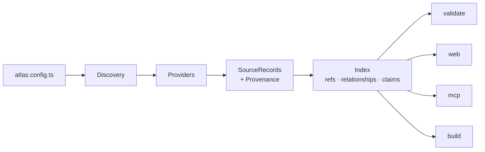

# Atlas — Scope and Technical Plan

**Status:** Draft for decision. Supersedes nothing; the Notion page *Atlas — Product
Vision & Technical Direction* remains the product thesis. This document decides how
that thesis is built.

**Audience:** Contributors to Atlas, and the maintainer deciding the stack.

---

## 1. What we are building

Atlas is an **installable toolkit that turns a repository's existing engineering
artefacts into an explorable, presentable and machine-readable model of the system.**

A developer adds Atlas to a codebase as a dev dependency. Atlas discovers what is
already there — an architecture model, documentation, decision records, API specs —
indexes it into a reference graph, and serves three audiences from that one graph:

| Audience | Needs | Atlas surface |
|---|---|---|
| A developer learning the system | Explore, follow a boundary, find the rationale | Web explorer and context panel |
| A developer explaining the system | Collect states, order them, present them live | Walkthrough tray, Studio, presenter |
| A coding agent changing the system | A resolved, bounded bundle of everything relevant to one thing | `atlas context` (a transport such as MCP comes later) |

The third audience is not an afterthought. The repository README frames the problem as
*"the Agentic SDLC, vibe coded html demos and unmaintainable docs"* — an agent that can
read the structured graph instead of grepping a wiki is the same product as a human who
can explore it. Both are projections of one index.

### Scope boundary

Atlas is **authoritative** for: walkthrough and scenario definitions, explicit
cross-source relationships, claim and evidence records, and the configuration that
assembles these into an experience.

Atlas is **not authoritative** for: architecture facts (LikeC4 owns those),
documentation (Markdown owns it), decisions (ADRs own them), interfaces (OpenAPI owns
them), or runtime behaviour (the running system owns it).

Everything Atlas renders is a projection with visible provenance. This is the single
rule that keeps the product honest, and it is enforced in the type system: a rendered
entity that cannot name its source is a bug, not a display choice.

---

## 2. Reference points

Three sources shape this plan, and each contributes something the others do not.

| Source | What we take |
|---|---|
| Notion vision doc | The product thesis, the Explore → Collect → Compose → Present → Learn loop, the source-of-truth boundary, the `AtlasRef` seam, the OSS/platform split |
| [SovereignAgenticArchitecture](https://github.com/CharlieAtki06/SovereignAgenticArchitecture) | Proof the loop works. The LikeC4 atlas page, the scene-driven presenter, `evidence.lock.json` commit pinning, and the **two-axis status model** (maturity × verification — "a claim is not its proof") |
| [a-h/cap](https://github.com/a-h/cap) | Modelling and tooling discipline. Invariant→verification linkage, bidirectional link integrity, `--format json` on every report, `cap context` as an agent bundle, convention auto-detection over imposed layout, `validate --strict` for CI |

SovereignAgenticArchitecture is the reference implementation and the first dogfooding
target. Its `portal/src/demo/scenes.ts` is a hand-written TypeScript array that does what
an Atlas walkthrough should do declaratively. **Migrating that file to an Atlas
walkthrough is the V0 acceptance test.** If Atlas cannot express what already exists, it
is not ready.

---

## 3. Design principles, and how each is enforced

Naming a principle is cheap. Each of these has a mechanism that fails the build when
violated.

### 3.1 SPOT — single point of truth

One definition, many consumers. Concretely:

| Truth | Defined once in | Consumed by |
|---|---|---|
| Walkthrough and config shape | Zod schemas in `core` | TS types, runtime validation, generated JSON Schema, editor autocomplete, published format reference |
| Reference identity | `AtlasRef` and its canonical string form | CLI, web, front matter, YAML, validation errors |
| The index | One generated artefact | CLI reports, web app, static build, and any later transport |
| Stack decisions | ADRs in `docs/adr/` | This plan links to them; it does not restate them |

The format reference published on the docs site is **generated** from the Zod schema. A
hand-written schema document is a second truth that will drift, so we do not write one.

### 3.2 SoC — separation of concerns

Four layers, strictly ordered:

```text
domain  ←  application  ←  adapters  ←  delivery
(rules)    (use cases)     (I/O)       (CLI, web, service)
```

- **Domain** knows the rules and nothing about the world. No filesystem, no network, no
  LikeC4, no React.
- **Application** orchestrates use cases against **ports** (interfaces), never against
  concrete adapters.
- **Adapters** implement ports for real systems.
- **Delivery** wires everything and talks to humans or agents.

### 3.3 Decoupling

Dependencies point inward, never outward or sideways. Enforced by `dependency-cruiser`
in CI, not by convention:

- `core` depends on **nothing** but `zod`. That single exception is deliberate — the
  schema *is* the domain definition, so the validator is not an external concern.
- No adapter imports another adapter.
- No delivery package is imported by anything.
- The web app never imports a provider. It reads the generated index.

Third parties must be able to write a provider without forking Atlas. If the LikeC4
adapter can do something a third-party adapter cannot, the port is wrong.

### 3.4 DDD

Six bounded contexts, each owning its language. A context is named for what it owns, not
for the technology it uses. Following cap's discipline: concepts are nouns, capabilities
are verbs on one noun; no `manage*` catch-alls.

| Context | Owns | Core concepts |
|---|---|---|
| **Reference** | Identity and addressing | `AtlasRef`, canonical form |
| **Workspace** | Configuration and source discovery | `AtlasConfig`, `SourceLocation` |
| **Projection** | Turning external sources into normalised records | `Provider`, `SourceRecord`, `Provenance` |
| **Graph** | Relationships, traversal, referential integrity | `Relationship`, `Index`, `Neighbourhood` |
| **Narrative** | Walkthroughs — the truth Atlas owns | `Walkthrough`, `Scene` |
| **Assurance** | Claims, evidence, verification status, gaps | `Claim`, `Evidence`, `Gap` |

Later contexts, deliberately absent from V1: **Observation** (acquiring runtime data) and
**Execution** (actions). They extend the same `AtlasRef` seam rather than rewriting it.

Each package README states its context, what it owns, and what it may depend on. A
package that cannot state its context in one sentence is doing two jobs.

### 3.5 Testing

Tests are structured by layer, not by file. See §11 for the full strategy. The
non-negotiable one: **a provider contract test kit**. Every provider — ours and third
parties' — passes the same published suite. This is what makes the provider boundary a
real boundary rather than an aspiration.

### 3.6 Documentation

Atlas documents Atlas using Atlas. The docs site is built by Atlas from Atlas's own
LikeC4 model and Markdown, and `atlas validate --strict` runs against Atlas's own model
in CI. This is simultaneously the best demo, a permanent integration test, and the thing
that stops the product drifting from its users' reality.

---

## 4. Tech stack decisions

Decided now. Each row is an ADR to be written; the rationale here is the summary.

### 4.1 Foundation

| Concern | Decision | Why | Considered and rejected |
|---|---|---|---|
| Language | **TypeScript**, `strict`, ES2022 | See §4.4. The differentiator is the visual layer, and LikeC4's parser, ELK layout and React renderer are JS-only | **Go** (cap's choice); **Go CLI + JS renderer** hybrid — both rejected in §4.4 |
| Monorepo | **Bun workspaces**, `bun --filter` for task running | Fast, one tool for install, run, test and bundling. At this size a separate task orchestrator earns nothing | pnpm + Turborepo — Turbo's remote caching and task graph pay off at a scale this project is not at, and can be added later without disruption |
| Dev runtime | **Bun** | Install and test speed, built-in bundler, and `bun build --compile` is the single-binary path | — |
| Published output | **Node-compatible ESM**, Node ≥ 22.22.3 | Developing with Bun and requiring Bun of consumers are different decisions. Consumers get plain JS that also runs under Bun. LikeC4's supported engine sets the current floor. | Requiring Bun of consumers — narrows adoption for no gain |
| Distribution | **npm packages** now; `bun build --compile` single binary later | npm reaches JS repos immediately. The binary recovers most of Go's distribution advantage for non-JS repos | Binary-first — wrong order given the JS-native renderer |
| Schema and validation | **Zod** | One definition yields TS types, runtime validation and JSON Schema. This is SPOT in a library | Hand-written JSON Schema + ajv (two truths); TypeBox (weaker inference ergonomics) |
| Task running | **xc**, tasks defined in Markdown | The task runner executes the documentation, so commands and docs cannot drift — the SPOT principle applied to the build. Without xc installed, the README still shows copy-pasteable commands; a Makefile's fallback is unreadable | Makefile (opaque fallback); `package.json` scripts alone (not self-documenting, duplicate into the README) |
| Dev environment | **`flake.nix` dev shell + `.envrc`**, optional | Pins Bun, Node, graphviz and Playwright browsers reproducibly for those who want it | **Requiring** Nix — contributors to a JS project expect `bun install`, and Playwright browsers under Nix are fiddly. Offer it, do not dictate it |
| Release | **Changesets** | Standard for OSS TS monorepos, generates changelogs from PRs | Manual tagging |
| Lint and format | **ESLint** (flat config) + **Prettier**, plus **dependency-cruiser** | dependency-cruiser is the decoupling guarantee from §3.3 | Biome — fast, but boundary-rule tooling is weaker, and boundaries are the point |

**Task ownership split.** `package.json` scripts own package-level `build` and `test`
where npm tooling and CI conventions require them. xc owns repository-level workflows —
dev, release, docs, fixtures, spikes. Split by scope, never duplicated; a task defined in
both places is two truths.

### 4.2 Formats

| Concern | Decision | Why | Considered and rejected |
|---|---|---|---|
| Walkthrough format | **YAML**, with generated JSON Schema for editor support | A walkthrough is ordered structured data with small prose fields. YAML diffs cleanly in a PR | **TypeScript** (SovereignAgenticArchitecture's current `scenes.ts`) — not reviewable as data, not readable by other tools, not writable by the author service. **Markdown** (cap's choice) — right for prose entities, wrong for ordered scenes |
| Relationship declaration | **Markdown front matter** for doc→architecture links; `atlas/relationships.yaml` for links the source cannot express | Puts the link next to the thing it describes where possible, with one escape hatch. Settles Notion §16's open question | Mapping-file-only (links rot away from their subject); inference (not in V1) |
| Reference form | **Canonical string** `provider:kind/externalId[#fragment]`, e.g. `likec4:view/system-landscape`, `markdown:section/docs/governance.md#policy-evaluation` | A struct is fine in code, but front matter, YAML and PR review all need a greppable string. Parsed to `AtlasRef` at the boundary | Opaque hashes (unreviewable); nested YAML objects (verbose in front matter) |
| Index artefact | **Generated JSON**, content-addressed, git-ignored | The repository stays the durable store. No database in the core toolkit | SQLite; Graphiti at V1 — kept behind the `KnowledgeIndex` port instead |
| Evidence pinning | **`atlas/evidence.lock.json`**, modelled on SovereignAgenticArchitecture's | Makes a build's claims reproducible against pinned source revisions | Trusting whatever is checked out |

### 4.3 Delivery

| Concern | Decision | Why | Considered and rejected |
|---|---|---|---|
| Web app | **Vite + React 19 + TypeScript**, standalone, with embeddable routes | Keeps Atlas usable in any repo. A separate optional Docusaurus plugin covers embedding. Settles Notion §16's "bundle or integrate" question: **both, in that order** | Docusaurus plugin only — couples the product to one docs framework and its lifecycle |
| Architecture rendering | **LikeC4** React components | Code-native model, addressable views and elements, already proven in SovereignAgenticArchitecture | Structurizr (render server dependency); Mermaid (no queryable model) |
| Styling | **Tailwind v4**, with **design tokens as CSS custom properties** | Productive, large ecosystem. The token layer is what matters for theming and embedding, and custom properties keep it framework-independent | CSS Modules — fine, but the choice is mostly syntax once tokens are separate. See the preflight constraint below |
| Client state | **Zustand**, for tray and presenter session only | The index is static data. There is no server to query | Redux (overweight); TanStack Query (no server-state problem to solve) |
| Author service | **Hono**, bound to `127.0.0.1`, origin-checked, token-handshaked | Tiny and runtime-portable. The same handler code could later run in a hosted control plane | Express (heavier); raw `node:http` (hand-rolled routing and validation) |
| Agent interface | **Deferred.** `atlas context` ships; no MCP server in V1 | See §7.4. The bundle is useful with no AI integration at all, and a transport is a thin adapter over it later | Choosing between the official SDK and either FastMCP now — a decision with no V1 consequence |
| Docs site | **Docusaurus**, built by Atlas, dogfooding Atlas | Proves the product and acts as a permanent integration test | VitePress — would mean not dogfooding the Docusaurus adapter |
| Unit and integration tests | **Vitest**, everywhere | The web package needs Vite integration and a DOM environment, and one runner across all packages beats a faster one in some of them | `bun test` — quicker for the pure domain packages, but splitting runners by package means two configurations, two assertion styles and two CI paths; Jest |
| End-to-end tests | **Playwright** | Matches SovereignAgenticArchitecture | Cypress |
| ADRs | **adr-tools** convention in `docs/adr/`, and Atlas honours `.adr-dir` | Interoperates with cap and with projects that already use adr-tools. Detect, do not dictate | A bespoke ADR format |

**Tailwind preflight is scoped, never global.** Preflight is Tailwind's base reset. In an
embeddable route it will overwrite the host site's typography, and it may collide with
LikeC4's own component styles. Scope it to the Atlas root rather than `html`/`body`, and
confirm the LikeC4 interaction in the Phase 0 spike. Keeping design tokens as CSS custom
properties means the token layer survives if Tailwind is ever swapped out.

### 4.4 Why TypeScript, and when that would be wrong

The deciding question is whether Atlas is a CLI that happens to have a UI, or a UI that
happens to have a CLI. cap is the former, and Go is the right answer for it. Atlas is the
latter: the product is *explore, collect, present*, and the CLI is supporting cast. The
differentiator is the visual layer, so the visual layer's language wins — and LikeC4's
model parser, ELK-based layout and React renderer are JS-only.

**The hybrid is rejected explicitly.** A Go CLI with a JS renderer means the domain model
exists twice, or is generated across a language boundary; the Go CLI would still shell
out to Node to render LikeC4; and there would be two test suites. For a solo maintainer
that is a tax paid on every feature, and it contradicts §3.1.

Go's real advantage is distribution — a single binary, installable into a Python, Rust or
Java repository with no Node present, where "unmaintainable docs" is just as true. Two
things blunt it, and both are deliberate hedges rather than accidents:

- `bun build --compile` produces a single executable from TypeScript.
- `core` stays pure and I/O-free, and the index is a documented JSON contract, so a future
  Go CLI could read the index without reimplementing the domain.

**This decision would flip** if Atlas's centre of gravity moved to the CLI and agent
bundle and the visual layer stopped being the differentiator. That is worth re-examining
at the end of Phase 2, not before.

---

## 5. Repository structure

```text
apprise-atlas/
├── packages/
│   ├── core/                 # domain. Reference, Graph, Narrative, Assurance models and rules
│   ├── toolkit/              # application. Use cases, ports, index building, orchestration
│   ├── provider-likec4/      # adapter
│   ├── provider-markdown/    # adapter (Markdown, front matter, ADR convention, Docusaurus)
│   ├── provider-testkit/     # the contract suite every provider must pass
│   ├── cli/                  # delivery. atlas init/dev/build/validate/show/graph/context
│   ├── author/               # delivery. Local author service
│   └── web/                  # delivery. Explorer, Studio, presenter
├── fixtures/                 # sample repositories for end-to-end tests
│   ├── minimal/
│   ├── likec4-docusaurus/
│   ├── no-architecture/
│   └── broken-references/
├── atlas/                    # Atlas's own walkthroughs and relationships (dogfooding)
├── architecture/             # Atlas's own LikeC4 model (dogfooding)
├── docs/
│   ├── adr/
│   └── dev/
├── site/                     # the published documentation site
├── flake.nix                 # optional pinned dev shell
├── .envrc                    # direnv, for those using the Nix shell
└── README.md                 # also the xc task definitions
```

Eight packages looks like a lot. V0 builds **four** — `core`, `toolkit`,
`provider-likec4`, `provider-markdown` — plus a throwaway harness. The rest are created
when they are needed. The structure is declared now so the boundaries form early;
creating them later means they never form at all.

A `mcp/` package is **not** in this tree. It is a later adapter over the `atlas context`
contract, and creating it early would invite the bundle format to be shaped around one
transport.

### Dependency rules

```text
core          →  (zod only)
toolkit       →  core
provider-*    →  core
testkit       →  core, toolkit
cli           →  core, toolkit, providers
author        →  core, toolkit
web           →  core (types only), generated index
```

`web` importing a provider is a CI failure. So is `core` importing anything but `zod`.

---

## 6. The domain model

Sketched to fix the shape, not to fix the syntax. These live in `core` as Zod schemas
with inferred types.

### 6.1 Identity

```typescript
type AtlasRef = {
  provider: string;    // "likec4" | "markdown" | "confluence" | ...
  kind: string;        // "view" | "element" | "document" | "section" | "decision" | ...
  externalId: string;  // stable within the provider
  fragment?: string;   // heading anchor, focused element
  version?: string;    // commit, page version
};

// canonical: "likec4:view/system-landscape"
//            "likec4:element/governance.gateway"
//            "markdown:section/docs/governance.md#policy-evaluation"
```

Everything addressable is an `AtlasRef`. This is the seam Notion §10 calls out as the
one thing V1 must get right, and it is the reason the later knowledge graph, telemetry
mapping and action model do not require a rewrite.

### 6.2 Projection

```typescript
type Provenance = {
  sourcePath?: string;     // repository-relative
  sourceUrl?: string;      // external system or backend
  sourceVersion?: string;  // commit or page version
  contentHash?: string;
  query?: string;          // for a source that is queried rather than read
  retrievedAt?: string;
};

type SourceRecord = {
  ref: AtlasRef;
  title: string;
  summary?: string;
  text?: string;                         // searchable body
  provenance: Provenance;                // never optional. No provenance, no render
  attributes: Record<string, unknown>;   // provider-specific, opaque to the domain
};
```

`attributes` is deliberately opaque. The domain must not learn what a LikeC4 element
tag means, or the coupling the provider boundary exists to prevent is back.

### 6.3 Graph

```typescript
type Relationship = {
  from: AtlasRef;
  type: string;                 // "documented-by" | "justified-by" | "observed-as" | ...
  to: AtlasRef;
  origin: "source" | "explicit" | "inferred" | "runtime";
  provenance: Provenance;
  confidence?: number;          // inferred only
  validFrom?: string;           // a derived fact is true for a window, not forever
  validUntil?: string;
};
```

`origin` is what lets the UI distinguish a maintained fact from a suggestion — the
distinction Notion §8 insists on and which any later inference feature depends on.

`validFrom` and `validUntil` exist in V1 although nothing emits `runtime` yet. See §10:
a derived fact that cannot expire is a fact that will eventually mislead.

### 6.4 Narrative

```yaml
id: governance-overview
title: Governance Overview
description: How a governed model request moves through the platform.

scenes:
  - id: landscape
    ref: likec4:view/system-landscape
    title: System context

  - id: gateway
    ref: likec4:view/governance#governance-gateway
    title: Request entry point
    notes: Policy selection is outside the model's control.

  - id: policy-evaluation
    ref: markdown:section/docs/governance.md#deterministic-policy-evaluation
    title: Deterministic controls

  - id: close
    kind: narrative
    title: Governance is part of the request path
    body: Evidence is recorded without depending on one vendor.
```

One change from Notion §5: a scene carries a **ref**, not a `kind` plus provider-shaped
fields. The kind is derived from the ref. `kind: narrative` is the only case with no ref,
because it has no source. This removes a whole class of invalid states — a scene cannot
declare `kind: architecture` while pointing at a document.

### 6.5 Assurance

This context does not exist in the Notion doc. It is the synthesis of
SovereignAgenticArchitecture's two-axis status model with cap's invariant→verification
linkage, and it is the strongest idea either reference project has.

```typescript
type Claim = {
  subject: AtlasRef;
  maturity: "implemented" | "prototype" | "planned" | "scaffold" | "external";
  verification: "live" | "automated" | "source" | "design";
  evidence: Evidence[];
};

type Evidence =
  | { kind: "test";   path: string; pinned?: string }
  | { kind: "source"; ref: AtlasRef }
  | { kind: "run";    url: string; at: string }
  | { kind: "design"; ref: AtlasRef };
```

Maturity and verification are **independent axes**. A component can be fully implemented
and verified only by design; a planned component can have an automated contract test. The
portal's own legend already says it: *a claim is not its proof*. Modelling it makes
`atlas validate` able to report the gap cap reports — a capability with no verification —
against a *visual* architecture model, which neither reference project does today.

---

## 7. How it works

### 7.1 Install and initialise

```bash
bun add -d @apprise-atlas/cli   # or npm/pnpm/yarn — the published output is plain Node ESM
npx atlas init
```

`init` inspects the repository and reports what it found rather than imposing a layout —
cap's `.adr-dir` pattern generalised:

```text
Detected
✓ LikeC4 model          architecture/
✓ Docusaurus            portal/
✓ Documentation         docs/
✓ ADRs                  docs/adr/        (via .adr-dir)
✓ OpenAPI               contracts/openapi.yaml

Created
✓ atlas.config.ts
✓ atlas/walkthroughs/
✓ atlas/relationships.yaml
```

### 7.2 The pipeline



One index, four consumers. Adding a fifth consumer must not require touching a provider.

### 7.3 Commands

Reports borrowed wholesale from cap, because once the index exists they are nearly free
and they make the graph usable without the web app at all.

| Command | Does |
|---|---|
| `atlas init` | Discover sources, scaffold configuration |
| `atlas dev` | Run the web app and the author service |
| `atlas build` | Generate a static, read-only site |
| `atlas validate [--strict]` | Structural, reference and link-symmetry checks; gap reporting |
| `atlas list <kind>` | Entities of a kind |
| `atlas show <ref>` | One entity, what it links to, what links to it |
| `atlas graph [ref] [--depth N] [--exclude ...]` | Hierarchy or whole model |
| `atlas context <ref>` | The resolved bundle an agent reads |

**Every command supports `--format json`.** `atlas graph` also supports `--format dot`.
This is cap's discipline and it costs nothing if built in from the first command; it is
expensive to retrofit once output shape is load-bearing in someone's CI.

### 7.4 `atlas context` — the agent bundle

Given `atlas context likec4:element/governance.gateway`, Atlas resolves the element, its
description, its documentation, the ADRs that justify it, its interface contract, its
claims and evidence, and its neighbours in the graph — and emits one bounded bundle as
Markdown or JSON.

An agent asked to change the Governance Gateway currently greps. With this, it reads the
same projection a human would, with provenance attached, and with the architecture model
telling it where the boundaries are. Given Atlas's first dogfooding target is itself an
agentic architecture with hard non-negotiable seams, an agent that can see those seams
before editing is the point.

**No AI integration is required for this to be useful.** `atlas context` is a
deterministic, testable CLI command. A developer pipes it into whatever agent they
already use. That is why it ships in V1 while the MCP server does not.

**The one thing to protect now** is that the bundle is a *versioned output contract*
owned by the application layer, not a CLI formatting concern. An MCP server, an HTTP
endpoint or a hosted API are then thin adapters over it — each perhaps a couple of
hundred lines. Shaping the bundle around a transport is the mistake this deferral exists
to avoid.

### 7.5 Author service safety

A browser page cannot write files, so `atlas dev` runs a small local service. Its
constraints are design constraints, not implementation details:

- Bound to `127.0.0.1` only.
- `Origin` checked against the dev server, plus a per-session token handshake. Any
  website open in the same browser can otherwise POST to localhost.
- Writes confined to configured Atlas paths — no arbitrary filesystem access.
- Every write schema-validated before it lands.
- Atomic writes; formatting preserved where practical.
- The exact diff is surfaced before and after writing.
- `atlas build` output contains no write API and no editing controls.

---

## 8. The provider boundary

The contract is deliberately small. If a provider needs more than this, the extra
belongs in `attributes`, not in the port.

```typescript
interface Provider {
  readonly id: string;
  discover(workspace: Workspace): Promise<readonly SourceLocation[]>;
  project(workspace: Workspace, location: SourceLocation): Promise<Loaded<SourceRecord[]>>;
  relate?(records: readonly SourceRecord[]): Promise<Loaded<Relationship[]>>;
}
```

Providers only project their own sources and their declared links. Resolving references is
the generated index's job, so every provider stays stateless and no provider gets an
opinion about another provider's records.

The `KnowledgeIndex` port from Notion §10 is declared in V1 and implemented only as
`GeneratedLocalIndex`. Declaring it costs one file and keeps Graphiti or a managed index
a later substitution rather than a later rewrite.

The same applies to observation. Declared in V1, implemented by nothing:

```typescript
interface ObservationSource {
  readonly id: string;
  observe(refs: AtlasRef[], window: TimeWindow): Promise<Observation[]>;
}
```

An `Observation` resolves to `Evidence` (§6.5) rather than to a parallel status system.
See §10 for why that unification matters.

V1 ships two providers. The boundary is defined early precisely so that shipping two does
not accidentally define the interface as "whatever LikeC4 and Markdown happen to need" —
the contract test kit is what keeps that honest.

---

## 9. Open source and product boundary

The toolkit is MIT and must be **complete and credible on one repository**. Everything in
§7 is open source, including the provider SDK and any later agent transport. A toolkit that is
crippled to protect a future product earns neither adoption nor third-party providers.

The split is a rule, not a feature list. A feature list needs re-arguing every time
something new is proposed:

> **Open-source Atlas is stateless beyond the repository. The product is everything that
> requires state a repository cannot hold.**

| Concern | State lives in | Side |
|---|---|---|
| Walkthroughs, relationships, configuration | Git | OSS |
| Evidence pins, telemetry mappings | Git | OSS |
| Querying your observability backend with your credentials | Nowhere — federated | OSS |
| Identity, sessions, who may see which environment | Users | Product |
| Telemetry retention, history, deploy comparison | Time series | Product |
| Cross-repository and organisation-wide graphs | Spanning repos | Product |
| Managed credentials, approval gates, audit log | Secrets, append-only records | Product |
| Comments, ownership, collaboration | People | Product |

The product **consumes the toolkit's output rather than replacing it** — `atlas build`
emits a static site, `atlas publish` sends the same index to a control plane. One
pipeline, two sinks. If the product ever needs its own indexer, there are two products.

**Licensing recommendation, needing a decision now:** keep the toolkit MIT, and put any
future hosted control plane in a **separate repository under a different licence**. MIT
does not protect a managed-service business, and relicensing after outside contributions
arrive requires their consent. Deciding the split before the first external PR is far
cheaper than deciding it after.

---

## 10. Runtime, and the seams it needs now

Nothing in this section is built in V1. It is here because a few decisions are expensive
to reverse, and knowing which ones lets the rest be deferred honestly.

### 10.1 Atlas is never the source of runtime truth

Showing real API calls on an architecture diagram involves five facts. Atlas owns one:

| Fact | Owned by | Atlas's role |
|---|---|---|
| The API service exists | Architecture model (repo) | Project |
| It exposes `POST /assessments` | OpenAPI (repo) | Project |
| That endpoint served 4,200 calls today, p95 340ms | The running system and its backend | Project, attributed, **never store as truth** |
| `service.name=apprise-api` *is* that model element | **Atlas configuration (repo)** | **Own** |
| This relationship is exercised in production | Derived from the two above | Derive, and label as derived |

The mapping is the only durable thing Atlas adds, and it is an architectural assertion,
so it belongs in the repository — versioned, diffed, reviewed in a pull request. This is
the same rule §1 applies to documents: Atlas never becomes the place a fact lives.

### 10.2 The mapping is a relationship, not a special block

Notion §11 sketches a bespoke `telemetry:` block hanging off each architecture element.
That is a second mechanism for something the model already expresses. A mapping is a
`Relationship` with `type: "observed-as"` and `origin: "explicit"`, from a model element
to an `AtlasRef` such as `otel:service/apprise-api`.

Modelling it this way means it validates, traverses, renders and reviews through
machinery that already exists in V1, and it costs nothing now — the only V1 obligation is
not inventing the special-purpose block.

### 10.3 Telemetry is evidence, not decoration

SovereignAgenticArchitecture's `docs/reference/evidence-and-maturity.md` already defines
`verification: live` as *"the claimed path has been observed end to end against real
local dependencies"* — telemetry's job description, written before telemetry exists.

So an observation is not a parallel status system. It is an automated producer of
`Evidence` for a `Claim` (§6.5), and `Evidence` already has `{ kind: "run" }`. Runtime
work extends the Assurance context rather than bolting a dashboard onto the side of it.

The division of labour: **Observation** is the adapter that gets the data,
**Assurance** decides what it proves.

### 10.4 Derived facts expire

A runtime-derived relationship needs `origin: "runtime"`, provenance naming the backend
and query, and a validity window. *"This endpoint is unused"* observed three months ago
is not stale information, it is actively dangerous advice. This is why `validFrom` and
`validUntil` are in the V1 `Relationship` type despite nothing emitting them yet, and it
is the same concern as SovereignAgenticArchitecture's evidence-staleness check.

### 10.5 What the gap is worth

The commercially interesting output is not a live badge. It is the disagreement between
what the model claims and what the runtime shows:

| Disagreement | Means |
|---|---|
| Element in the model, no traffic | Dead component, or a broken mapping |
| Service in telemetry, no element in the model | Undocumented component |
| Relationship in the model, never exercised | Design fiction |
| Call path in traces, absent from the model | **Undocumented coupling** |

Atlas resolves none of these. It surfaces a disagreement between two sources it does not
own, and a human fixes it in the authoritative one. That is the projection layer doing
its job, and it generalises to any product with instrumented calls — it is not specific
to the first dogfooding target.

### 10.6 The seams, ranked by cost to retrofit

Being honest about what does *not* need doing now is the useful part.

**Expensive later, therefore required in V1:**

1. **The rendering layer takes an optional overlay.** Views render as *model + overlay*,
   with the overlay empty. Retrofitting a decoration concept means touching every render
   path. The overlay must also be **toggleable off** — if design and observed reality
   cannot be visually separated, the two-axis model is defeated.
2. **`origin` and validity on relationships** (§6.3).
3. **Mappings expressed as relationships** (§10.2) — an obligation to *not* build
   something, which is the cheapest kind.

**One file each, worth declaring:**

- `ObservationSource` port (§8), implemented by nothing.
- Provenance covering queried sources (§6.2).

**Already covered, no action:** `AtlasRef` addresses runtime identities with no special
casing; `Evidence` already has `kind: "run"`; ref-less scene kinds are already the
extension point that later action and observation scenes would use.

**Deliberately skipped:** execution modes (static, simulated, live). A presenter-local
concern with no data-model consequence, genuinely cheap to add later. Declaring a
single-valued enum now would be ceremony, not a seam.

### 10.7 Tiers, recorded for later scoping

Not a plan, and not in an order that implies sequencing. These differ enormously in
cost, and separating them stops "show runtime data" being treated as one feature.

| Tier | Shows | Needs |
|---|---|---|
| 1 | Endpoints from OpenAPI drawn on the element that serves them | Repository only — no runtime at all |
| 2 | Rate, error rate, latency per element or relationship | A metrics query against an existing backend |
| 3 | A single trace rendered as a path across the view | Span-to-element resolution, and a decoratable renderer |
| 4 | A recorded trace replayed as a walkthrough scene | Tier 3, plus scene kinds that are not ref-shaped |

Tier 1 is repository-only and could arrive with no observation work whatsoever. Tier 3
is the one worth wanting — a real request drawing its own line across the architecture is
a categorically better explanation than a static arrow, and it is where the presenter and
the runtime converge. It is also the tier most constrained by what LikeC4 permits.

Static builds cannot do tiers 2–4 live; a published site has no credentials and no
backend. The honest answer there is a snapshot pinned at build time, displayed as *last
known* and never as *current* — which is exactly an `Evidence` record (§10.3), not a
special case.

---

## 11. Testing strategy

| Layer | Method | Standard |
|---|---|---|
| Domain (`core`) | Pure unit tests, no I/O | The rules are here, so coverage is highest here. Fast enough to run on save |
| Ports and use cases (`toolkit`) | Use-case tests against in-memory fakes | No real filesystem, no real provider |
| Providers | **Contract test kit** — every provider runs the same published suite | A provider that passes is usable; one that does not, is not. This is the decoupling guarantee |
| CLI | Golden-file tests on `--format json` | `--format json` exists partly to make this cheap |
| Web | Vitest + Testing Library for components; Playwright for Explore → Collect → Present | The loop is the product; it gets an end-to-end test |
| Whole toolchain | Fixture repositories in `fixtures/` | Atlas's input is *a repository*, so the test input must be repositories, including broken ones |
| Dogfooding | `atlas validate --strict` against Atlas's own model, in CI | Catches drift between the product and its own documentation |

`fixtures/broken-references/` deserves emphasis: the promise in Notion §2.2 is that a
source change fails **clearly and locally** rather than at the next demo. That promise is
a test fixture, not a paragraph.

---

## 12. Phasing

### Phase 0 — spikes (before committing)

1. **LikeC4 programmatic integration.** Can we drive view selection, element focus and
   selection events from outside LikeC4's own app shell, and read the model
   programmatically? This is the highest technical risk in the whole plan; if it fails,
   the rendering strategy changes and much of §4.3 with it. Confirm the Tailwind
   preflight interaction with LikeC4's own component styles in the same spike.
2. **Author-service write loop.** Browser → local service → validated atomic write →
   visible diff, with the origin and token handshake in place.

### Phase 1 — V0, prove the loop

The Notion §17 vertical slice, against SovereignAgenticArchitecture:

Open landscape → select an element → see its linked document and decision → add to
walkthrough → add a document section → present → save YAML → validate in CI.

**Acceptance:** `portal/src/demo/scenes.ts` is expressible as an Atlas walkthrough, and
renaming a referenced LikeC4 element produces a useful validation error.

### Phase 2 — V1, reusable toolkit

Both providers, the contract test kit, explorer and context panel, tray, Studio,
presenter, author service, CLI reports, `atlas context`, static build, assurance model,
CI validation.

Ends with a checkpoint on §4.4: has the centre of gravity stayed with the visual layer?

### Phase 3 — V1.x, depth and portability

Richer relationship authoring, search, embeddable routes, provider SDK hardening, the
first non-repository document provider, architecture bootstrap experiment, MCP server
over the `atlas context` contract.

### Later

Telemetry overlay, simulated then live actions, temporal knowledge layer behind the
existing port, hosted platform.

**Explicitly deferred from V1**, restating Notion §14 because this is where scope creep
enters: AI assistant, continuous architecture inference, hosted collaboration, cloud
accounts, broad provider catalogue, production actions, an observability backend, a
free-form canvas.

---

## 13. Risks

| Risk | Mitigation |
|---|---|
| LikeC4 integration does not expose what the explorer needs | Phase 0 spike, before the stack is committed |
| Source renames silently break references | Validation is a first-class command, runs in CI, and has a dedicated broken-reference fixture |
| Scope creep from the vision's §8–§13 | Ports declared, implementations deferred. Nothing in §8–§13 is built in V1 |
| The provider boundary shapes itself around its first two implementations | Contract test kit written against the port, not against LikeC4 |
| Eight packages become overhead on a one-person project | Four in V0; the rest created on demand |
| Dogfooding target is also the maintainer's other project, so problems look like Atlas bugs | `fixtures/` gives Atlas an input it controls independently |

---

## 14. Decisions needed before Phase 0

1. **npm scope and CLI binary name.** `atlas` on `$PATH` collides with
   [ariga.io/atlas](https://atlasgo.io), a widely installed database schema tool. This
   plan assumes packages under `@apprise-atlas/*`. The binary needs a call: `apprise`,
   or `atlas` accepted only via `npx` within a project.
2. **Licence split.** Confirm MIT for the toolkit, separate repository and licence for
   any future hosted plane (§9).
3. **Dogfooding target.** Confirm SovereignAgenticArchitecture as the V0 target, and
   whether migrating `scenes.ts` to an Atlas walkthrough is the acceptance test.
4. **Assurance in V1 or V1.x.** §6.5 is the strongest idea here but it is net-new scope
   beyond the Notion doc. Recommendation: model it in `core` for V1 and ship only the
   read-only status display, deferring gap reporting to V1.x.

---

## 15. What this document does not decide

Documentation structure beyond `docs/adr/` and `docs/dev/` — the next planning pass, as
agreed. Also unsettled and deliberately left open: whether "walkthrough" or "scenario" is
the right long-term term once executable variants exist (Notion §16), and the exact
front-matter syntax for relationship declaration.

Runtime is scoped but not planned. §10 fixes the seams and the source-of-truth rule; it
does not decide which observation tier ships first, which backends get adapters, or how
an overlay is drawn. Tier 3 in particular — a trace rendered as a path across a view —
depends on what LikeC4 allows to be decorated, which the Phase 0 spike answers.
